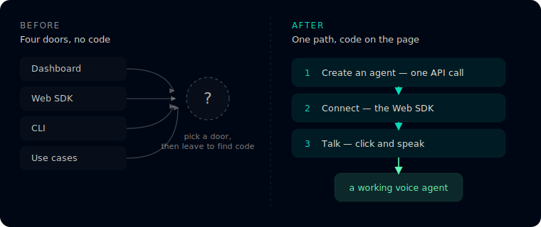

<div align="center">

# Manicule sample: Vapi quickstart, rebuilt

[](https://manicule-sample-brief-posg.vercel.app)
[](eval/RESULTS.md)


**A developer quickstart, rebuilt for its two readers: developers and coding agents.**

### Live demo → https://manicule-sample-brief-posg.vercel.app

[The rebuilt page](rebuild/quickstart.mdx) · [The agent eval](eval/RESULTS.md) · [Scout memo](scout.md)



</div>

Your Supermemory rebuild sets a standard I wanted to test on a stranger: a first page that gets a
developer to a working result quickly, without a detour. I found a company in your ICP whose
quickstart buries that result, and rebuilt its opening page around a single path. Then I built what
a markdown file leaves out: a rendered page and diagrams, a spec check on every call, and an
agent-comprehension test.

The company is **Vapi** (voice AI agents), not one of your customers. Its quickstart promises "your
first voice agent in 5 minutes," then makes the reader pick between four starting points and leave
the page to find code.

## The result

| | Vapi's current page | This rebuild |
| --- | :---: | :---: |
| **Agent eval** (code an AI agent writes, scored against Vapi's spec) | 62 / 100 | **100 / 100** |
| **Docs-quality gate** (flow, voice, agent-readability) | 41.7 | **100** |

Vapi's voice already scores 100. The gap is flow and the agent map, so the rebuild keeps their voice
and fixes the structure.

## What's in here

| Path | What it is |
| --- | --- |
| [`AGENTS.md`](AGENTS.md) | What a coding agent reads first: layout, commands, and the editing rules. The repo ships what the essay argues for. |
| [`site/`](site/index.html) | The rebuilt quickstart, rendered in Vapi's identity. Deploys as a static site; this is the [live demo](https://manicule-sample-brief-posg.vercel.app). |
| [`rebuild/`](rebuild/) | The source: [`quickstart.mdx`](rebuild/quickstart.mdx), a clean [`.md` twin](rebuild/quickstart.md), and an [`AGENTS.md`](rebuild/AGENTS.md). |
| [`scout.md`](scout.md) | Why Vapi, and the gap, quoted from their live page. |
| [`VERIFICATION.md`](VERIFICATION.md) | Every call checked against Vapi's OpenAPI spec. |
| [`eval/`](eval/RESULTS.md) | The agent-comprehension test: its grader, plus the raw code each agent wrote. |
| [`blog/`](blog/docs-your-agents-cant-test.md) | The essay behind the eval, rendered as a [companion page](https://manicule-sample-brief-posg.vercel.app/essay). |
| [`geo/`](geo/RESULTS.md) | An AEO/GEO/SEO checker; both rendered pages score 100/100/100 after the gaps it surfaced. |
| [`harness/`](harness/) | The docs scorer and the `lint` gate that keeps the writing clean. |

## The agent test

Docs are the interface an AI agent codes against, so the useful question is not "does this page have
an `AGENTS.md`," but "can an agent actually build from it." I gave coding agents the task of
integrating Vapi, once with only the current page and once with only the rebuild, and scored the
code they wrote against Vapi's OpenAPI spec. The grader is blind to which page produced the code.

| Run | Current page | Rebuild + `AGENTS.md` |
| --- | :---: | :---: |
| 1 | 66 | 100 |
| 2 | 66 | 100 |
| 3 | 54 | 100 |
| **Average** | **62** | **100** |

An agent held to "do not invent what the docs do not state" stalls on the current page in every
run here, because the page never states the API. From the rebuild, it finishes in all three runs.

<details>
<summary><b>See what an agent wrote from Vapi's current page</b> (scored 54)</summary>

```js
// "The snapshot does NOT state any concrete API surface: no REST endpoints, no SDK
// package names, no method signatures... left as placeholders rather than fabricated."
// const vapi = new Vapi(publicKey);   // <FILL FROM VAPI WEB SDK GUIDE>
button.addEventListener("click", () => {
  // <FILL FROM VAPI WEB SDK GUIDE>: start a web call to the assistant.
});
```
</details>

<details>
<summary><b>See what an agent wrote from the rebuild</b> (scored 100)</summary>

```js
// server: private key stays here
const res = await fetch("https://api.vapi.ai/assistant", {
  method: "POST",
  headers: { Authorization: `Bearer ${process.env.VAPI_PRIVATE_KEY}`, "Content-Type": "application/json" },
  body: JSON.stringify({ name: "Support agent", model: {/*...*/}, voice: {/*...*/}, firstMessage: "..." }),
});
const assistant = await res.json();

// browser: public key only, started on a click
import Vapi from "@vapi-ai/web";
const vapi = new Vapi("YOUR_PUBLIC_KEY");
document.querySelector("#talk").addEventListener("click", () => vapi.start("YOUR_ASSISTANT_ID"));
```
</details>

<details>
<summary><b>How the grader works, and how to reproduce it</b></summary>

`eval/grade.ts` scores code against Vapi's real API: correct endpoint, public-vs-private key
placement, `vapi.start(assistantId)`, no invented `projectId`, and a veto if a private key appears
in browser code. It never sees which page produced the code.

```bash
node eval/grade.ts eval/runs/B1.txt   # one run
for f in eval/runs/*.txt; do echo "$f"; node eval/grade.ts "$f" | grep score; done
```
Full method and limits in [`eval/RESULTS.md`](eval/RESULTS.md).
</details>

## Run it

```bash
# the rendered page
python3 -m http.server --directory site      # http://localhost:8000

# the agent eval
node eval/grade.ts eval/runs/B1.txt

# the editorial gate over every prose file
node harness/src/lint.ts
```

<details>
<summary><b>How the writing stays clean</b> (the loop)</summary>

Every draft runs `harness/src/lint.ts` (em-dashes, AI-rhythm tells, banned phrases) and an isolated
critic for the judgment calls a regex misses (sycophancy, over-claiming). The banned patterns live in
[`harness/src/rules.ts`](harness/src/rules.ts) and the scoring rubric in [`harness/rubric.md`](harness/rubric.md).
The gate returns clean on every deliverable prose file in this repo.
</details>

## Notes and limits

- The code is verified against Vapi's published OpenAPI spec. I could not run it against a live
  account without a paid key. See [`VERIFICATION.md`](VERIFICATION.md).
- Vapi already ships an `llms.txt` and an MCP server. The gap I filled is the human first-run path
  and a missing `AGENTS.md`.
- The eval is three runs per condition, a demonstration rather than a study.

---

**Sai Vsr** · siri.rangasai@gmail.com
